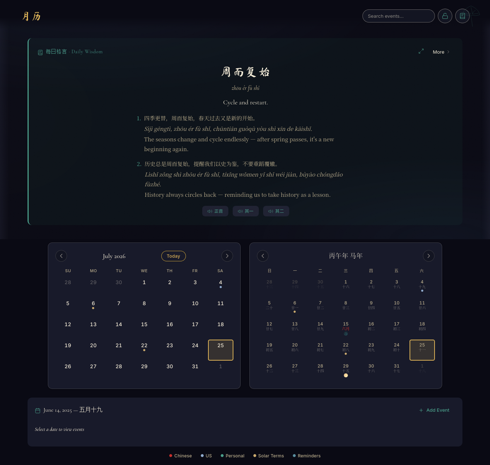

# 月历 · Yueli

> *Heavenly Harmony (天和)* — A personal calendar that unites the Gregorian and Chinese Lunisolar calendars, wrapped in traditional Chinese design philosophy.




## Overview

Yueli (月历, "moon calendar") is a personal, encrypted web calendar that displays both the Gregorian and Chinese Lunisolar (农历) calendars side by side with equal prominence. Holidays and special dates are color-coded using the Wu Xing (五行) Five Elements system. Personal events are encrypted client-side with AES-256-GCM, with optional browser-based reminders.

The aesthetic draws on the Qinglu (青绿) design tradition — atmospheric, dark-themed, with jade and azure accents — prioritizing readability while honoring traditional Chinese color philosophy.

## Features

- **Dual Calendar Display** — Gregorian and 农历 calendars shown side by side with equal prominence
- **Lunar Phase Markers** — 🌑🌒🌓🌔🌕🌖🌗🌘 glyphs on the lunisolar calendar
- **24 Solar Terms (节气)** — Calculated and marked on the lunisolar calendar
- **Holidays** — Chinese (7 major) + US (11 federal + 8 common observances)
- **Personal Events** — Encrypted client-side, supports timed, all-day, and multi-day events
- **Daily Agenda Panel** — Selected date's events + holidays + solar terms
- **Reminders** — Browser notifications, client-side only (fires while app is open)
- **Client-Side Encryption** — AES-256-GCM with PBKDF2 key derivation; master password protects all events
- **Auto-Lock** — 15-minute inactivity timeout; locked state shows presence dots only
- **Export / Import** — Encrypted `.db` file backup and restore
- **Daily Wisdom (每日格言)** — Weighted-random Chinese idiom of the day with pinyin, English, and audio
- **Seasonal Atmosphere** — Four-season color temperature shifts with botanical whispers
- **Responsive** — Mobile-friendly stacked layout
- **Keyboard Navigation** — Arrow keys, Home = today, N = new event

## Color System — Wu Xing (五行)

| Category | Element | Color | Dot |
|----------|---------|-------|-----|
| Chinese Holidays | Fire (火) | Red `#d4380d` | 🔴 |
| US Holidays | Metal (金) | Silver-Blue `#8faacc` | 🔵 |
| Personal Events | Wood (木) | Jade Green `#4a9e8a` | 🟢 |
| Solar Terms | Earth (土) | Muted Gold `#c9a96e` | 🟡 |
| Reminders | Water (水) | Azure `#5a8e9e` | 🔵 |

## Tech Stack

| Layer | Technology |
|-------|------------|
| Server | Node.js + Express |
| Database | sql.js (SQLite compiled to WebAssembly) |
| Encryption | Web Crypto API (AES-256-GCM + PBKDF2) |
| Frontend | Vanilla HTML / CSS / JavaScript |
| Design | Qinglu aesthetic + Wu Xing color tokens |

## Getting Started

### Prerequisites

- Node.js 18+
- npm

### Installation

```bash
git clone https://github.com/PimplesOnNose/yueli.git
cd yueli
npm install
```

### Running

```bash
# Start the server
./start.sh

# Or run directly
npm start
```

The app will be available at `http://localhost:3001` (or `https://localhost:3001` if SSL certificates are present in `certs/`).

### First Visit

1. Open the app in your browser
2. Create a master password (this encrypts all your events client-side)
3. Start adding events to your calendar

## Usage

### Creating Events

1. Click any date on the calendar
2. Click **+ Add Event** in the agenda panel
3. Fill in title, date, time, and optional reminder
4. Click **Save**

### Keyboard Shortcuts

| Key | Action |
|-----|--------|
| ← → ↑ ↓ | Navigate dates |
| Home | Go to today |
| N | New event |
| L | Lock |
| / | Focus search |
| Escape | Close modal |

### Exporting Backups

Click the scroll icon in the header to download an encrypted `.db` file backup. To restore, use the import endpoint.

## Project Structure

```
yueli/
├── server.js              # Express server
├── package.json
├── templates/
│   └── index.html         # Single page app shell
├── static/
│   ├── css/               # Stylesheets (Qinglu design system)
│   ├── js/
│   │   ├── app.js         # Main controller
│   │   ├── crypto.js      # Client-side encryption (AES-256-GCM)
│   │   ├── gregorian.js   # Gregorian calendar rendering
│   │   ├── lunisolar.js   # 农历 calendar rendering
│   │   ├── schedule.js    # Personal event CRUD
│   │   ├── reminders.js   # Browser notification engine
│   │   ├── wisdom.js      # Daily idiom engine
│   │   └── utils.js       # Date helpers, formatters
│   ├── data/              # Idiom database
│   ├── audio/             # Pronunciation audio files
│   └── assets/            # Icons, seasonal SVGs
└── scripts/               # Utility scripts
```

## API Endpoints

| Method | Endpoint | Description |
|--------|----------|-------------|
| POST | `/api/setup` | Create master password (first visit) |
| POST | `/api/unlock` | Verify password, return session token |
| POST | `/api/lock` | Lock the app |
| GET | `/api/status` | Check setup and lock state |
| GET | `/api/events` | List events for date range |
| POST | `/api/events` | Create new event |
| PUT | `/api/events/:id` | Update event |
| DELETE | `/api/events/:id` | Delete event |
| GET | `/api/events/reminders` | Get upcoming reminders |
| GET | `/api/export` | Download encrypted backup |
| POST | `/api/import` | Restore from backup |

## Design Philosophy

The app's design is guided by traditional Chinese aesthetic principles:

- **Wu Xing (五行)** — Color system maps to Five Elements; each data type gets its own element
- **Yin-Yang (阴阳)** — Dark theme base (Yin) with luminous accents (Yang)
- **Feng Shui (风水)** — Symmetrical dual-calendar layout with clear energy flow
- **Readability First** — Calendar grids stay clean; atmosphere lives in transitions

## Security

- All personal event data is encrypted client-side using AES-256-GCM
- The encryption key is derived from your master password via PBKDF2 (10,000 iterations)
- The key is held in memory only — never written to disk or sent to the server
- The server only stores encrypted blobs; it cannot read your event data
- Auto-lock after 15 minutes of inactivity

## License

MIT License

Copyright (c) 2023 PimplesOnNose

Permission is hereby granted, free of charge, to any person obtaining a copy
of this software and associated documentation files (the "Software"), to deal
in the Software without restriction, including without limitation the rights
to use, copy, modify, merge, publish, distribute, sublicense, and/or sell
copies of the Software, and to permit persons to whom the Software is
furnished to do so, subject to the following conditions:

The above copyright notice and this permission notice shall be included in all
copies or substantial portions of the Software.

THE SOFTWARE IS PROVIDED "AS IS", WITHOUT WARRANTY OF ANY KIND, EXPRESS OR
IMPLIED, INCLUDING BUT NOT LIMITED TO THE WARRANTIES OF MERCHANTABILITY,
FITNESS FOR A PARTICULAR PURPOSE AND NONINFRINGEMENT. IN NO EVENT SHALL THE
AUTHORS OR COPYRIGHT HOLDERS BE LIABLE FOR ANY CLAIM, DAMAGES OR OTHER
LIABILITY, WHETHER IN AN ACTION OF CONTRACT, TORT OR OTHERWISE, ARISING FROM,
OUT OF OR IN CONNECTION WITH THE SOFTWARE OR THE USE OR OTHER DEALINGS IN THE
SOFTWARE.

---

Crafted with 🤖 [Pi](https://pi.dev) | [GLM](https://z.ai)
